# Retail Channel Performance Dashboard

A portfolio Data Engineering project that simulates how raw retail sales data can be transformed into a PostgreSQL analytical model that powers a Power BI dashboard for retail performance analytics.

## Project Overview

This project models a realistic consumer goods reporting scenario in which a company needs to monitor sales performance across regions, distributors, product categories, stores, and sales channels.

The pipeline transforms a raw retail transaction dataset into a dimensional warehouse model and exposes business-ready metrics for interactive reporting in Power BI.

## Business Scenario

A consumer goods company distributes products through regional distributors and retail stores. Management needs a reporting layer to track performance across:

* regions
* distributors
* product categories
* sales channels

The business goal is to convert raw sales transactions into a structured analytical dataset that supports KPI tracking and performance analysis.

## Tech Stack

* Python
* Pandas
* PostgreSQL
* SQL
* Power BI

## Architecture

The project follows a simple end-to-end analytics engineering flow:

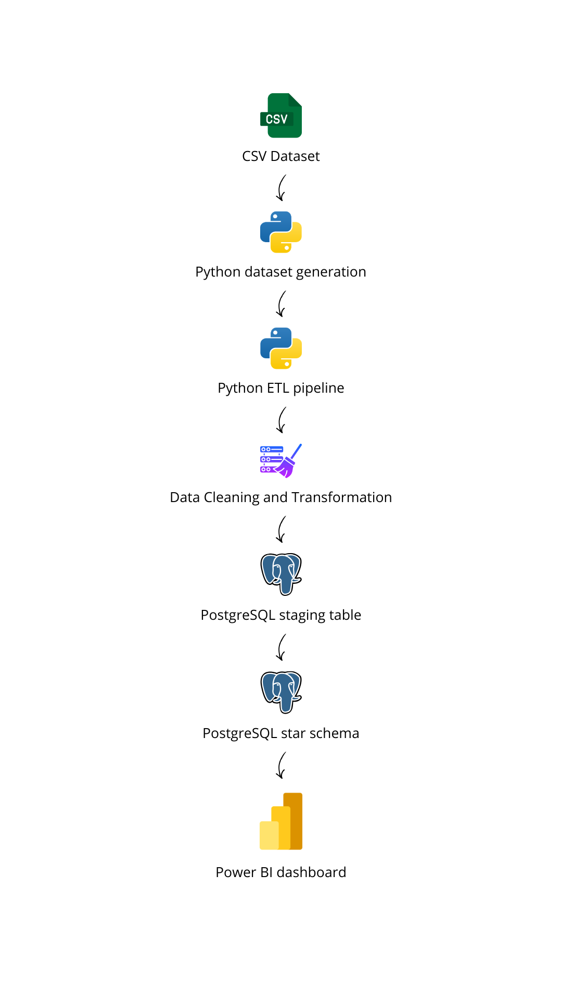

## Data Model

The warehouse uses a dimensional model optimized for analytics.

### Staging layer

* `stg_retail_sales`

### Dimension tables

* `dim_date`
* `dim_region`
* `dim_product`
* `dim_distributor`
* `dim_store`
* `dim_channel`

### Fact table

* `fact_sales`

For simplicity in this portfolio project, all database objects were created in PostgreSQL’s default `public` schema. In a production environment, staging and analytics objects would typically be separated into dedicated schemas.

## Dataset

The project uses a synthetic retail sales dataset generated with Python to simulate a realistic retail distribution scenario.

### Raw dataset fields

* `transaction_date`
* `region`
* `distributor`
* `store`
* `sales_channel`
* `product`
* `category`
* `units_sold`
* `revenue`

### Dataset characteristics

* multiple regions
* multiple distributors and stores
* product and category mix
* multiple sales channels
* sales volume variability by channel
* small pricing fluctuations to simulate real commercial behavior

## Repository Structure

```text
retail-channel-performance-dashboard/
├── data/
│   ├── raw/
│   └── processed/
├── scripts/
├── etl/
├── sql/
├── dashboard/
├── screenshots/
├── docs/
├── requirements.txt
├── .gitignore
├── .env.example
└── README.md
```

## Environment Setup

Create and activate a virtual environment, then install the dependencies:

```bash
python -m venv .venv
.venv\Scripts\Activate.ps1
pip install -r requirements.txt
```

## Database Configuration

Create a local `.env` file based on `.env.example`:

```env
DB_HOST=localhost
DB_PORT=5432
DB_NAME=retail_channel_performance
DB_USER=postgres
DB_PASSWORD=your_password_here
```

Create the PostgreSQL database and run the schema creation script before loading data.

## How to Run the Project

### 1. Generate the raw dataset

```bash
python scripts/generate_dataset.py
```

### 2. Create the warehouse tables

Run the SQL script in PostgreSQL:

```sql
CREATE DATABASE retail_channel_performance;
```

Then execute:

```bash
psql -U postgres -d retail_channel_performance -f sql/create_tables.sql
```

### 3. Run the ETL and warehouse load

```bash
python -m etl.run_pipeline
```

### 4. Run validation queries

```bash
psql -U postgres -d retail_channel_performance -f sql/quality_checks.sql
```

### 5. Open the Power BI dashboard

Open:

```text
dashboard/retail_channel_dashboard.pbix
```

## ETL Pipeline

The ETL pipeline is organized into modular Python components:

* `extract.py` reads the raw CSV dataset
* `transform.py` standardizes, validates, and cleans the data
* `load.py` loads processed data into PostgreSQL
* `run_pipeline.py` orchestrates the full pipeline

### Data quality rules applied

* required columns validation
* text standardization
* date parsing and validation
* numeric type enforcement
* positive value checks for `units_sold`
* positive value checks for `revenue`
* duplicate removal

## Warehouse Load

After data cleaning, the processed dataset is loaded into PostgreSQL in two stages:

1. `stg_retail_sales` receives the cleaned transactional data
2. SQL scripts populate the analytical star schema:

   * `dim_date`
   * `dim_region`
   * `dim_product`
   * `dim_distributor`
   * `dim_store`
   * `dim_channel`
   * `fact_sales`

The loading logic:

* reads database credentials from environment variables
* truncates tables for repeatable local execution
* loads staging data from CSV
* executes SQL scripts for dimensions and fact loading
* returns row-count summaries after execution

## Data Quality and Validation

The project includes SQL-based quality checks to validate the consistency of the warehouse after loading.

### Validation coverage

* row-count reconciliation between staging and fact tables
* revenue reconciliation
* units sold reconciliation
* null foreign key checks
* duplicate grain checks
* invalid value checks
* quick outlier inspection

### Analytical validation queries

Additional SQL queries were used to validate:

* monthly revenue trends
* regional revenue distribution
* category performance
* top products
* distributor performance
* sales channel performance

## Power BI Dashboard

The final reporting layer is a Power BI dashboard built on top of the PostgreSQL analytical model.

### Dashboard pages

1. Executive Overview
2. Regional Performance
3. Product Performance
4. Distributor Performance

### Core KPIs

* Total Revenue
* Units Sold
* Average Order Value
* Revenue Growth

### Model design

The dashboard consumes a PostgreSQL star schema with one fact table and multiple dimensions. Relationships were configured following star schema principles, with dimension tables filtering the fact table.

## Technical and Validation Assets

The following technical assets were captured throughout development to document the pipeline and support portfolio presentation.

### Raw Dataset Sample

A preview of the generated transactional dataset used as the pipeline input. This image helps illustrate the raw structure before transformation and loading.

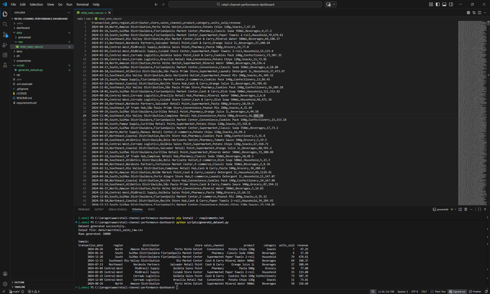

### PostgreSQL Star Schema

A screenshot of the PostgreSQL warehouse structure showing the staging table, dimension tables, and fact table. This image documents the dimensional model implemented for analytics.

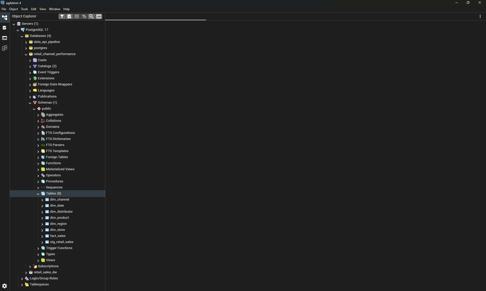

### ETL Transform Output

A terminal or file preview showing the extract-and-transform stage results, including processed row counts and data cleaning execution. This image demonstrates the pipeline’s transformation step.

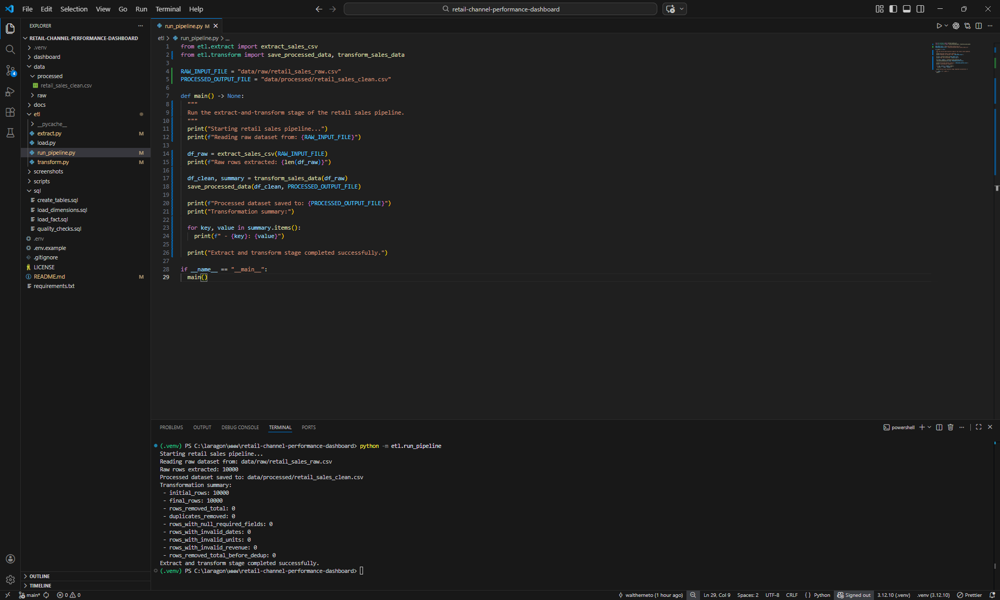

### Warehouse Load Summary

A screenshot showing successful warehouse loading into staging and analytical tables, including summary counts in both terminal and pgAdmin4. These images documents the loading stage of the pipeline.

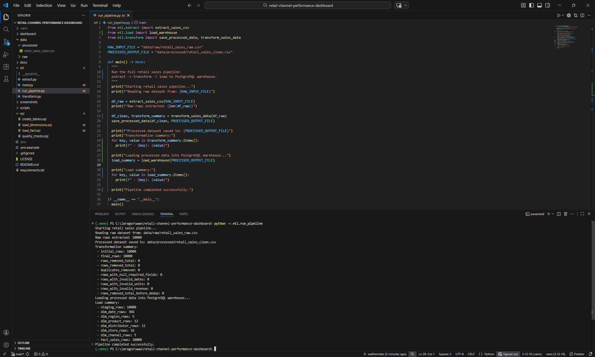

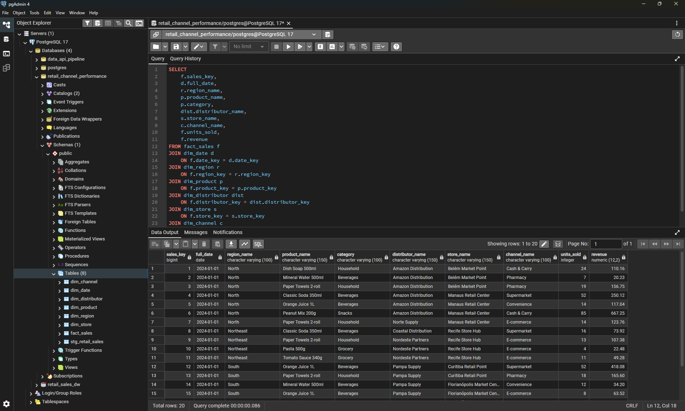

### Quality Checks Reconciliation

A screenshot of SQL-based reconciliation checks validating row counts, revenue, and units sold between staging and fact layers. This image demonstrates trust and consistency controls in the warehouse.

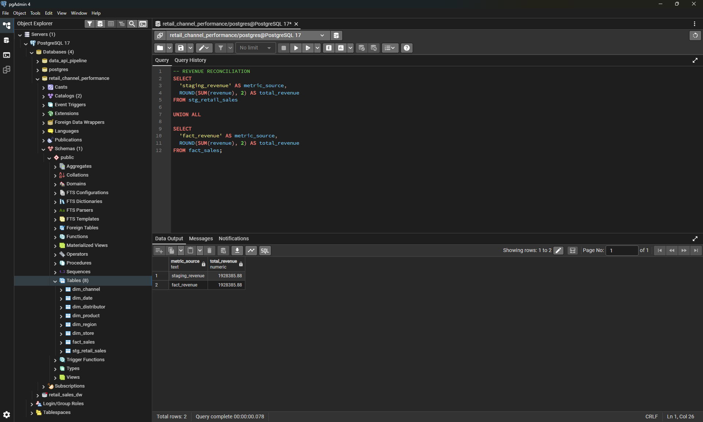

### Power BI Model View

A screenshot of the Power BI model view showing the star schema relationships between the fact table and dimensions. This image reinforces that the reporting layer was built on a structured analytical model rather than a flat dataset.

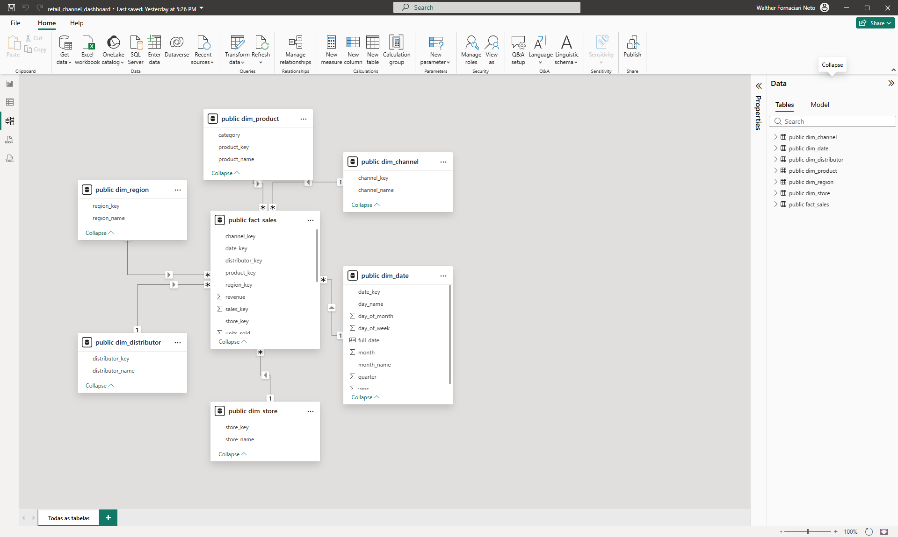

## Dashboard Preview

### Executive Overview

This page presents the main KPIs and a high-level view of retail performance across time, region, and sales channels.

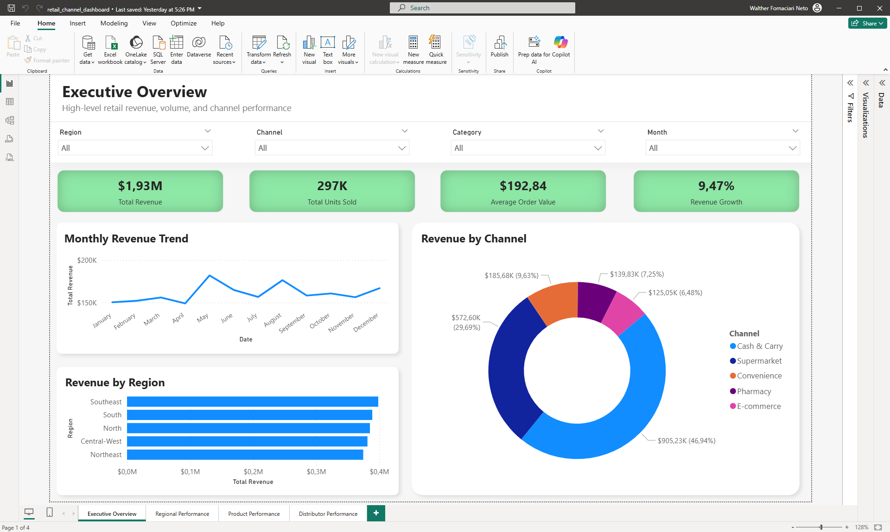

### Regional Performance

This page compares regional contribution and monthly revenue behavior across all operating regions.

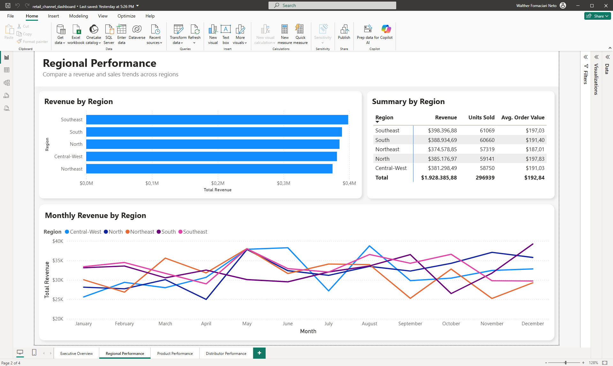

### Product Performance

This page highlights revenue by category and identifies the top-performing products in the portfolio.

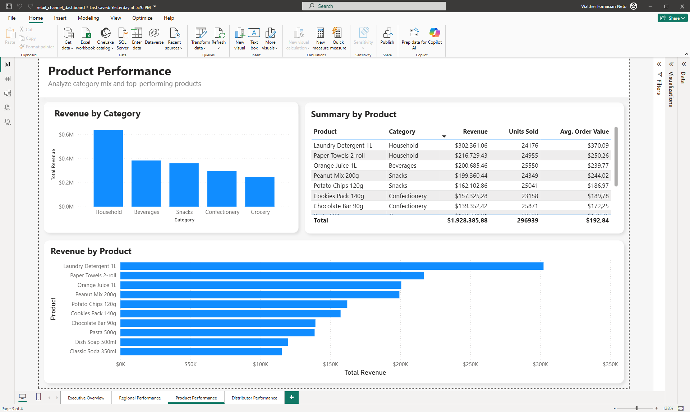

### Distributor Performance

This page evaluates distributor contribution using revenue, units sold, and summary metrics.

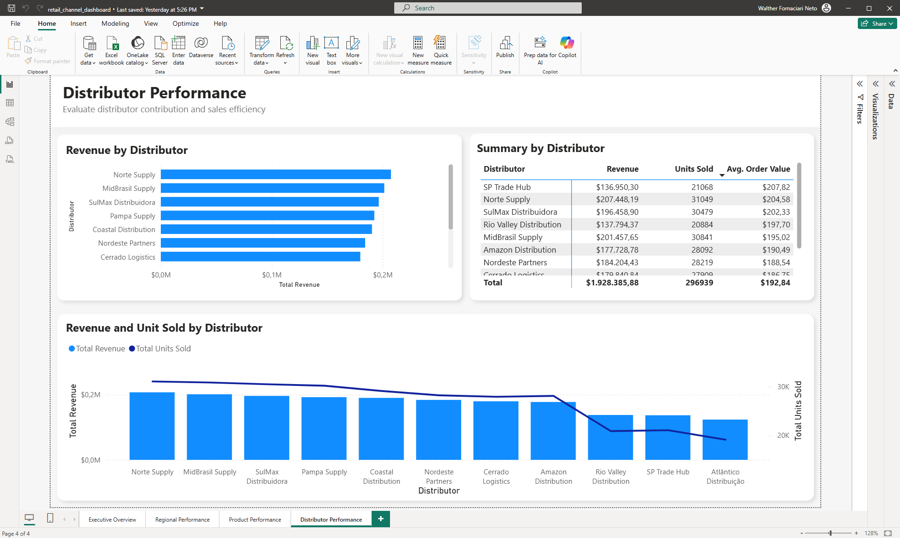

## Technical Highlights

* built a modular Python ETL pipeline
* implemented data cleaning and validation before warehouse loading
* designed a PostgreSQL dimensional model using a star schema
* automated loading into staging and analytical tables
* added SQL-based reconciliation and data quality checks
* delivered a Power BI dashboard on top of the warehouse model

## Note on Numeric Formatting

Numeric formatting in the dashboard was intentionally designed to follow the locale settings of the viewer’s machine or reporting environment. This mirrors a common enterprise reporting practice in multinational contexts, where numeric separators are rendered according to the end user’s regional standards. This approach is also consistent with prior project experience supporting clients such as BIMBO and McCain, where reports were often parameterized to respect local formatting conventions.

## Future Improvements

Possible next enhancements for this project:

* separate PostgreSQL objects into `staging` and `analytics` schemas
* add automated logging and run metadata
* add incremental loading logic
* add unit tests for transformation functions
* publish the dashboard with refresh-ready documentation

## Portfolio Value

This project demonstrates practical Data Engineering capabilities across:

* data generation
* ETL development
* data quality validation
* PostgreSQL warehouse design
* dimensional modeling
* BI delivery enablement

## Notes

1. For simplicity in this portfolio project, all tables were created in the default PostgreSQL public schema. In a production environment, staging and analytics objects would typically be separated into dedicated schemas.  

2. Numeric formatting in the dashboard was intentionally designed to follow the locale settings of the viewer’s machine or reporting environment. This mirrors a common enterprise reporting practice in multinational contexts, where numeric separators are rendered according to the end user’s regional standards. This approach is also consistent with prior project experience supporting clients such as BIMBO and McCain, where reports were often parameterized to respect local formatting conventions.

## Author

Walther Fornaciari Neto
